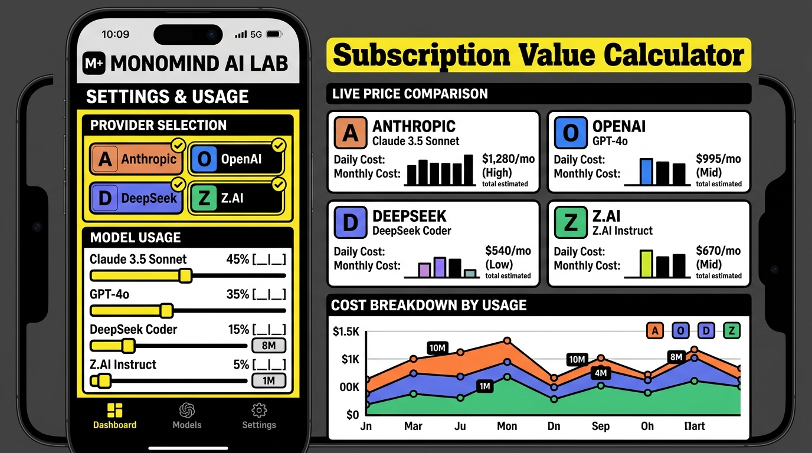

# MonoMind AI Lab - Subscription Value Calculator

> A financial intelligence tool for evaluating AI model subscriptions against pay-as-you-go API volume rates.



---

## 💡 Overview

**MonoMind AI Lab - Subscription Value Calculator** helps developer teams, researchers, and AI power users answer a critical financial question:

* **"When does paying for a flat-rate AI subscription (e.g., Claude Pro/Team, ChatGPT Plus/Business, Z.AI Team) make financial sense compared to paying per token via OpenRouter API volume rates?"**

The app fetches real-time OpenRouter model pricing, applies customized workload model weights, and dynamically calculates the exact breakeven point and financial savings.

---

## ✨ Key Features

### 1. 🏢 Comprehensive Multi-Provider Tiers
- Includes subscription tier breakdowns for leading global AI providers:
  - **Alibaba Cloud** (Model Studio / Pro Token Plan)
  - **Anthropic** (Free, Pro, Max 5x/20x, Team, Enterprise)
  - **DeepSeek** (Free, Plus, Pro)
  - **Grok / xAI** (Free, X Premium, X Premium+, SuperGrok, SuperGrok Heavy)
  - **Moonshot AI** (Adagio, Moderato, Allegretto, Allegro, Vivace)
  - **OpenAI** (Free, Go, Plus, Pro 5x/20x, Business / Team)
  - **Opencode Go** (Go Pro)
  - **Z.AI** (Lite, Pro, Max, Team Standard, Team Premium — supporting GLM-5.2, GLM-5.1, GLM-5, GLM-4.7, GLM-5-Turbo, GLM-4.5-Air, GLM-4.7-Flash, GLM-ASR-2512)
- All providers are listed in **alphabetical order** for rapid navigation.

### 2. 🧮 Dynamic Breakeven & Value Engine
- **Breakeven Volume**: Calculates the exact monthly token volume (in millions of tokens) at which subscription costs equal pay-as-you-go API costs.
- **Retail Value Score**: Computes the dollar value of token usage delivered by a subscription plan.
- **Max Capacity Potential**: Displays maximum token yield value if a plan's full quota is utilized.

### 3. 🎛️ Multi-Model Weighted Workload Mixer
- Select multiple models per provider to simulate real-world composite workloads (e.g., mixing heavy reasoning models with lightweight fast models).
- Adjust usage ratio percentage sliders with real-time recalculation of blended input/output token pricing.

### 4. 🎚️ Dynamic Target Usage Range Sliders
- Monthly usage sliders dynamically calibrate maximum ranges based on the token capacity of the selected plan.

### 5. 🌍 Built-in Multilingual Support
- High-performance top-right language switcher supporting 11 global languages:
  - **English** (Default)
  - **Korean** (한국어)
  - **Traditional Chinese** (繁體中文)
  - **Simplified Chinese** (简体中文)
  - **Japanese** (日本語)
  - **Spanish** (Español)
  - **French** (Français)
  - **German** (Deutsch)
  - **Finnish** (Suomi)
  - **Polish** (Polski)
  - **Russian** (Русский)
- **Protected Brand Terms**: All provider names, model IDs, and "OpenRouter" retain strict original spelling using HTML `notranslate` protection.

### 6. 🔗 Direct Official Pricing Links
- Convenient direct outbound links to official subscription & pricing pages for each provider as well as **OpenRouter API Prices**.

---

## 🔗 Official Subscription & Pricing Directories

| Provider | Service / Plan | Official Pricing Page |
| :--- | :--- | :--- |
| **Alibaba Cloud** | Model Studio / Coding Plan | [alibabacloud.com/campaign/ai-scene-coding](https://www.alibabacloud.com/campaign/ai-scene-coding) |
| **Anthropic** | Claude Pro / Team | [claude.com/pricing](https://claude.com/pricing) |
| **DeepSeek** | DeepSeek Plans | [api-docs.deepseek.com/quick_start/pricing](https://api-docs.deepseek.com/quick_start/pricing) |
| **Grok (xAI)** | Grok / SuperGrok | [x.ai/pricing](https://x.ai/pricing) |
| **Moonshot AI** | Kimi Plans | [kimi.com/help/kimi-api/api-pricing](https://kimi.com/help/kimi-api/api-pricing) |
| **OpenAI** | ChatGPT / Business | [openai.com/business/pricing](https://openai.com/business/pricing) |
| **Opencode Go** | Opencode Go | [docs.docker.com/ai/docker-agent/providers/opencode-go](https://docs.docker.com/ai/docker-agent/providers/opencode-go) |
| **OpenRouter** | OpenRouter Models & Pricing | [openrouter.ai/models](https://openrouter.ai/models) |
| **Z.AI** | GLM Coding Plan | [z.ai/subscribe?plantype=team](https://z.ai/subscribe?plantype=team) |

---

## 🛠️ Tech Stack & Architecture

- **Frontend Framework**: React 18 with TypeScript & Vite
- **Styling**: Neo-Brutalist design language with Tailwind CSS
- **Data Integration**: Live OpenRouter Public API integration
- **Translation Engine**: Browser-level translation layer with custom cookie persistence & DOM event triggers

---

## 🚀 Development Setup

1. **Install Dependencies**:
   ```bash
   npm install
   ```

2. **Run Development Server**:
   ```bash
   npm run dev
   ```
   The app will run on `http://localhost:3000`.

3. **Production Build**:
   ```bash
   npm run build
   ```

---

*Designed and maintained by MonoMind AI Lab.*
